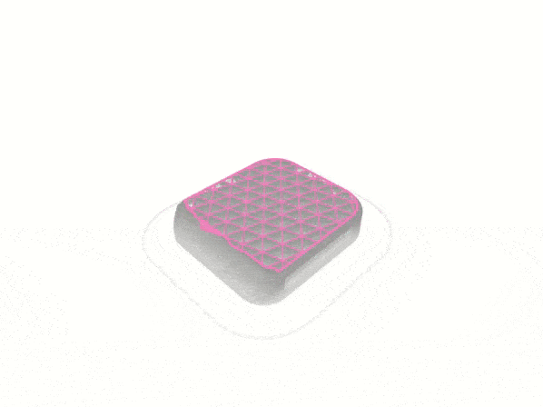

# react-gcode-viewer

React component for visualizing GCodes using Three.js.

<p align="center">
    
</p>

## Install

```shell
npm install --save react-gcode-viewer
```
or
```shell
yarn add react-gcode-viewer
```

## Usage

```js
import React from 'react';
import ReactDOM from 'react-dom';
import {GCodeViewer} from "react-gcode-viewer";

const url = "https://storage.googleapis.com/ucloud-v3/6127a7f9aa32f718b8c1ab4f.gcode"

const style = {
    top: 0,
    left: 0,
    width: '100vw',
    height: '100vh',
}

function App() {
    return (
        <GCodeViewer
            orbitControls
            showAxes
            style={style}
            url={url}
        />
    );
}

ReactDOM.render(<App />, document.getElementById('root'));
```
## Demos

You can see working the examples from `.storybook/stories` [here](https://gabotechs.github.io/react-gcode-viewer)

## Props

| Prop                       | Type                       | Required     | Notes                                                                                                                                                                                       |
| ----------------------     | :------------------------: | :----------: | :----------------------------------------------------------:                                                                                                                                |
| `url`                      | `string`                   | `true`       | url of the GCode file |
| `quality`                  | `number`                   | `false`      | (default 1) number between 0 and 1 specifying the render quality, for larger models it's recommended to lower this number, as it consumes a lot of resources |
| `visible`                  | `number`                   | `false`      | (default 1) number between 0 and 1 specifying the percentage of visible layers |
| `layerColor`               | `string`                   | `false`      | (default "grey") layer color |
| `topLayerColor`            | `string`                   | `false`      | (default "hotpink") top layer color |
| `showAxes`                 | `boolean`                  | `false`      | show x y z axis |
| `orbitControls`            | `boolean`                  | `false`      | enable camera orbit controls|
| `floorProps`               | `FloorProps`               | `false`      | floor properties, see below |
| `reqOptions`               | `RequestInit`              | `false`      | fetch options for customizing the http query made for retrieving the GCode file, only valid if "url" is specified |
| `onProgress`               | `(p: GCodeParseProgress) => any` | `false`| callback triggered on parsing progress |
| `onFinishLoading`          | `(p: GCodeParseProgress) => any` | `false`| callback triggered when GCode is fully loaded |
| `onError`                  | `(err: Error) => any`      | `false`      | callback triggered when an error occurred while loading GCode|
| `canvasId`                 | `string`                   | `false`      | id of the canvas element used for rendering the model |

The component also accepts ```<div/>``` props

## Interfaces

### FloorProps
| Prop                       | Type                       | Required     | Notes                                                                                                                                                                                       |
| ----------------------     | :------------------------: | :----------: | :----------------------------------------------------------:                                                                                                                                |
| `gridWidth`                | `number`                   | `false`      | if specified, a grid will be drawn in the floor with this width |
| `gridLength`               | `number`                   | `false`      | if specified, a grid will be drawn in the floor with this length |

### GCodeParseProgress
| Prop                       | Type                       | Notes                                                                                                                                                                                       |
| ----------------------     | :------------------------: | :----------------------------------------------------------:                                                                                                                                |
| `read`                     | `number`                   | number of bytes read from the url |
| `baseCenter`               | `{x: number, y: number}`   | x, y center of the rendered gcode model |
| `max`                      | `{x: number, y: number, z: number}` | maximum coordinates of the gcode model |
| `min`                      | `{x: number, y: number, z: number}` | minimum coordinates of the gcode model |
| `filamentLength`           | `number`                   | length of the filament used in mm |
